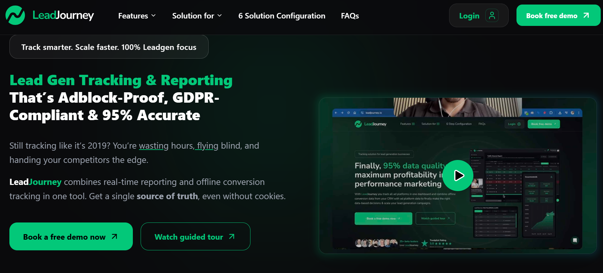
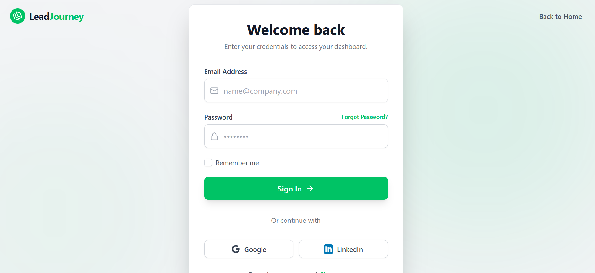
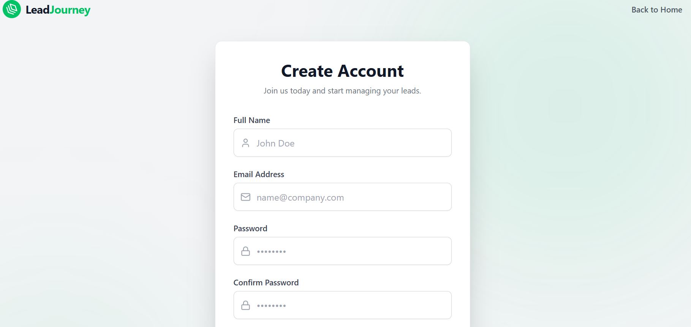
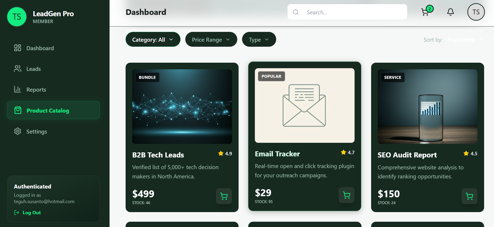
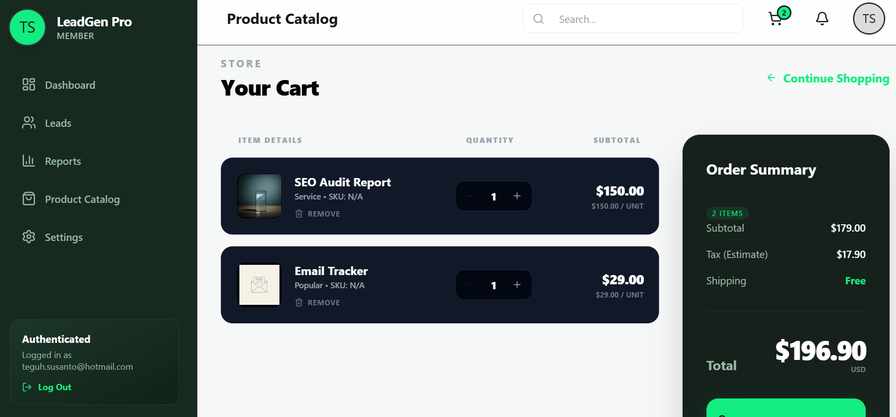
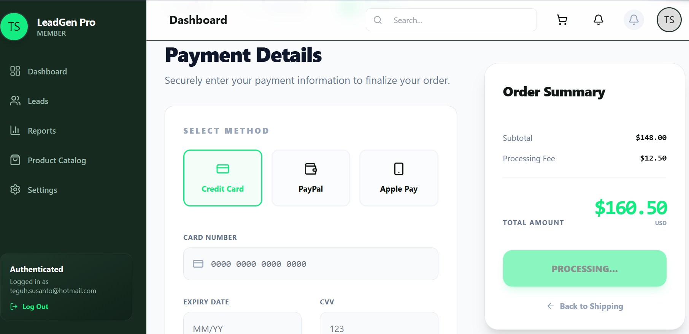
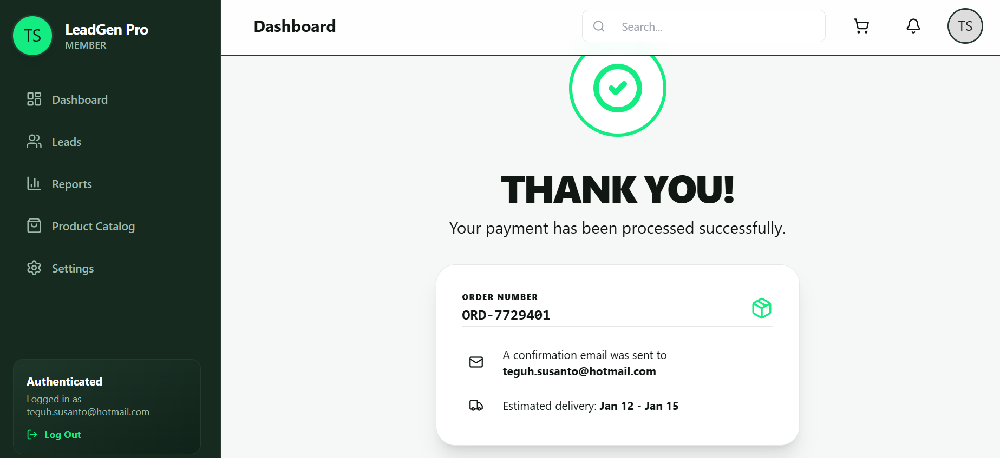

About LeadJourney
LeadJourney is a premium, high-performance e-commerce platform built with the TALL stack (Inertia, React, Tailwind). Designed for speed, security, and a seamless user experience, it features a modern high-contrast aesthetic with professional checkout flows, dark mode support, and robust state management.

Key Features
Fluid Checkout: Multi-step shipping and payment processing.

Dynamic UX: Built with React & Framer Motion for smooth transitions.

Secure Payments: Integrated stripe/payment gateway logic.

Adaptive UI: Fully responsive design with an emphasis on dark mode readability.

🛠 Environment Setup
To get the development environment running locally, follow these steps:

1. Prerequisites
Ensure you have the following installed:

PHP 8.2+

Composer

Node.js & NPM

MySQL 8.0+

2. Installation
Bash

# Clone the repository
git clone https://github.com/your-username/leadjourney.git

# Install PHP dependencies
composer install

# Install JS dependencies
npm install
3. Environment Configuration
Copy the example environment file and generate your application key:

Bash

cp .env.example .env
php artisan key:generate
4. Database Setup
Configure your .env with your database credentials:

Cuplikan kode

DB_CONNECTION=mysql
DB_HOST=127.0.0.1
DB_PORT=3306
DB_DATABASE=leadjourney
DB_USERNAME=root
DB_PASSWORD=
Then run the migrations and seeders:

Bash

php artisan migrate --seed
5. Running the Application
Bash

# Start the Laravel server
php artisan serve

# Start the Vite development server (in a separate terminal)
npm run dev
📖 Component Library
LeadJourney uses a custom design system centered around the #13ec80 (Neon Green) accent color.

Layouts: AuthenticatedLayout.jsx for dashboard views.

UI Components: Utilizes Lucide-React for iconography and Shadcn/UI patterns.

Forms: Powered by @inertiajs/react useForm for real-time validation.

🔒 Security
If you discover any security vulnerabilities within LeadJourney, please open an issue or contact the development lead directly. We prioritize security and will address vulnerabilities immediately.

📄 License
The LeadJourney E-commerce platform is open-sourced software licensed under the MIT license.

# Capture

